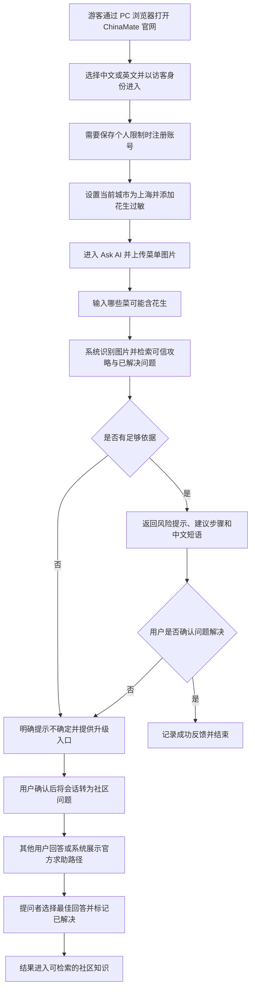

# ChinaMate 入境旅游平台 MVP 产品需求文档

## 1. 文档信息

| 项目 | 内容 |
| --- | --- |
| 文档名称 | ChinaMate 入境旅游平台 MVP 产品需求文档（PRD） |
| 产品阶段 | MVP 需求定义 |
| 文档版本 | v1.2 |
| 文档状态 | 待产品评审 |
| 目标读者 | 产品、设计、前端、后端、测试、内容运营、社区运营 |
| 技术约束 | Next.js、Spring Boot、MySQL、Spring AI |
| 产品形态 | PC 端官网，1920×1080 为核心设计与验收基准 |
| 计划首发语言 | 简体中文、英文（同版本首发） |
| 计划首发城市 | 上海、北京 |
| 更新时间 | 2026-07-21 |

> 本文档是产品范围和用户行为的评审基线，不代表数据库结构与 API 契约已经冻结。评审通过后，应通过 OpenSpec change 继续产出设计、规格和实施任务，再进入开发。

---

## 2. 项目背景

外国游客来华旅行的政策与市场环境正在改善，但实际旅行体验仍存在明显的信息与服务鸿沟：

- 海外搜索引擎和国际旅游平台中的中国本地信息不够完整、及时或可执行。
- 中国本地平台拥有丰富内容和商户数据，但语言、账号、实名、支付及使用习惯对外国游客不友好。
- 游客遇到点餐、购票、问路、支付、景区预约等即时问题时，缺少面向外国游客的统一求助入口。
- 传统攻略以长文章为主，用户仍需自行判断信息是否适用于当前城市、时间和个人限制。
- 通用 AI 可以回答问题，但存在信息过期、缺少本地上下文、无法说明依据和生成错误答案等风险。

因此，本产品不以“再做一个旅游内容平台”为目标，而是验证：

> 结构化攻略、任务型社区和有依据的 AI 助手能否协同帮助外国游客更快解决真实的在华旅行问题。

---

## 3. 产品定位

### 3.1 一句话定位

**ChinaMate 是一个面向来华外国游客的中国旅行互助平台，通过结构化本地攻略、任务型社区问答和 AI 实时助手，帮助游客快速找到可信信息并解决点餐、出行、购票、支付等实际问题。**

### 3.2 核心价值

**Know before you go. Get help when you need it.**

- 出发前：告诉游客需要准备什么、具体怎么做。
- 旅行中：根据当前城市、个人限制和现场材料提供可执行答案。
- AI 无法确认时：提供明确的社区求助或官方求助路径。
- 问题解决后：把真实结果沉淀为可复用、可验证的知识。

### 3.3 产品差异化

| 产品类型 | 主要能力 | ChinaMate 的差异 |
| --- | --- | --- |
| 国际 OTA | 酒店、机票、门票和标准产品预订 | 聚焦交易之外的现场问题解决 |
| 国际点评平台 | 英文点评、目的地内容 | 提供中国本地操作步骤和问题升级路径 |
| 中国本地内容平台 | 丰富且新鲜的本地内容 | 面向外国游客进行翻译、结构化与适用性判断 |
| 通用 AI 助手 | 自然语言问答和图片理解 | 使用受控知识源、标注依据，并连接社区求助闭环 |
| 传统旅游社区 | 游记、帖子和评论 | 以“具体问题是否解决”为社区内容最小单元 |

---

## 4. 产品目标与非目标

### 4.1 MVP 产品目标

1. 验证外国游客是否愿意在真实旅行场景中使用平台提问。
2. 验证 AI 与结构化攻略能否显著缩短常见问题的解决时间。
3. 验证 AI 无法处理的问题能否通过任务型社区获得有效补充。
4. 验证已解决问题能否沉淀为其他游客愿意使用的可信内容。
5. 找到用户使用频率最高、最适合后续商业化的旅行任务。

### 4.2 MVP 非目标

以下能力不进入 MVP：

- 完整的机票、酒店和旅行套餐交易平台。
- 自动生成多日完整行程的通用行程规划器。
- 关注关系、私信、达人体系和短视频信息流。
- 覆盖中国所有城市，以及简体中文、英文之外的其他语种。
- 原生移动端 App、微信小程序及移动端优先适配。
- 由社区承诺实时人工响应。
- 代替警方、医院、使领馆等专业紧急服务。
- 保存护照照片、银行卡信息等非必要高敏感数据。
- 自建地图、支付、即时通信或票务基础设施。
- 通过邮箱、手机号、验证码或第三方平台完成注册、登录和密码找回。

---

## 5. 目标用户

### 5.1 核心用户

首期核心用户为：

- 第一次或第二次来中国的外国自由行游客。
- 年龄以 20—45 岁为主，能够自主使用移动互联网产品。
- 主要使用英文获取旅行信息；部分用户能够使用中文，但仍需要外国游客视角的结构化帮助。
- 在上海或北京停留，并自行处理交通、支付、餐饮和景点预约。
- 不熟悉中国本地 App、手机号、实名及移动支付体系。

### 5.2 典型用户画像

#### 用户画像 A：首次来华的独自旅行者

- 姓名：Alex（虚拟）
- 年龄：28 岁
- 来源地：英国
- 旅行方式：独自自由行，上海停留 4 天
- 主要目标：低成本探索城市和本地餐饮
- 主要障碍：不会使用中文，不熟悉支付宝、地铁和本地地图

典型场景：抵达前搜索“如何使用上海地铁”，抵达后遇到支付失败，需要快速排查。

#### 用户画像 B：有明确限制的家庭游客

- 姓名：Sarah（虚拟）
- 年龄：37 岁
- 来源地：澳大利亚
- 旅行方式：与家人同行，北京停留 5 天
- 主要目标：安全、顺畅地参观主要景点
- 主要障碍：孩子对花生过敏，景点预约规则复杂

典型场景：把已经拍摄的菜单图片上传到官网确认过敏原，并获得可直接向服务员展示的中文表达。

#### 用户画像 C：追求本地体验的年轻游客

- 姓名：Miguel（虚拟）
- 年龄：31 岁
- 来源地：西班牙
- 旅行方式：多城市自由行
- 主要目标：寻找真实、小众且外国游客可以顺利使用的本地服务
- 主要障碍：海外平台信息不足，本地内容难以筛选和判断时效

典型场景：查询其他外国游客已经验证过的本地餐厅和具体消费流程。

---

## 6. 核心用户任务

MVP 优先解决以下六类高频任务：

| 任务类型 | 用户问题示例 | 期望结果 |
| --- | --- | --- |
| 支付 | “为什么我的银行卡无法绑定支付宝？” | 获得逐步排查方法和备用方案 |
| 上网 | “落地后怎样获得可用网络？” | 了解漫游、SIM/eSIM 和本地网络准备事项 |
| 交通 | “我在虹桥站，应该从哪里检票？” | 获得基于地点的清晰步骤和中文求助语 |
| 购票预约 | “故宫是否需要提前预约？” | 获得适用日期、证件和入口说明 |
| 点餐 | “菜单中哪些菜可能含花生？” | 获得翻译、风险提示和可展示的中文表达 |
| 问路与现场沟通 | “如何告诉司机去这个酒店？” | 获得可复制文字、地址卡片或语音表达 |

首发内容控制在约 **20 个高频任务卡片**，不追求完整目的地百科。

---

## 7. MVP 范围与优先级

### 7.1 模块总览

| 优先级 | 模块 | MVP 结论 |
| --- | --- | --- |
| P0 | 访客访问、账号与旅行上下文 | 必须提供低摩擦使用入口和最小个性化信息 |
| P0 | 结构化旅行攻略 | 必须建立 AI 可检索、用户可执行的可信知识基础 |
| P0 | AI 实时旅行助手 | 必须验证现场问题解决价值 |
| P0 | 任务型旅行社区 | 必须验证真人经验能否补足 AI 和攻略 |
| P1 | 一键求助与问题升级 | 应提供 AI 失败后的明确下一步 |
| P1 | 内容运营与社区治理后台 | 应保证内容可维护、可审核和可追溯 |
| P2 | 完整社交及交易能力 | MVP 验证完成后再决定是否建设 |

### 7.2 优先级定义

- **P0（必须有）**：缺失后无法验证 MVP 核心假设。
- **P1（应该有）**：不影响最小闭环成立，但影响体验、运营效率或风险控制。
- **P2（可以有）**：有潜在价值，但不应影响 MVP 上线周期。

---

## 8. 官网信息架构与 PC 布局基线

### 8.1 全局导航

MVP 采用 PC 官网形态，顶部全局导航固定包含：

1. **品牌 Logo**：点击返回官网首页。
2. **Home / 首页**：产品介绍、核心价值、推荐攻略和最新已解决问题。
3. **Ask AI / AI 助手**：文本提问、图片上传、连续对话和历史记录。
4. **Guides / 攻略**：按城市、主题和任务浏览结构化攻略。
5. **Community / 社区**：浏览问题、发布求助和查看自己的回答。
6. **语言切换**：在简体中文和英文之间切换。
7. **账号入口**：未登录时显示注册/登录，登录后显示头像和个人菜单。

### 8.2 官网首页结构

首页按照从品牌认知到核心功能转化的顺序组织：

1. 顶部导航区。
2. 首屏 Hero：一句话定位、核心价值、AI 提问输入框和主要行动按钮。
3. 核心场景区：支付、上网、交通、购票、点餐和问路。
4. 热门结构化攻略区。
5. 最新已解决社区问题区。
6. 产品可信度说明：来源、更新时间、AI 不确定性和官方求助边界。
7. 页脚：产品信息、隐私政策、服务条款、联系我们和语言入口。

### 8.3 PC 视觉与栅格基线

- 以 **1920×1080** 浏览器视口作为设计稿和核心验收基准。
- 页面主体建议使用最大宽度 **1440px** 的居中内容容器。
- 采用 12 栏栅格，主要内容与两侧留白保持稳定比例。
- 官网首屏在 1920×1080 下应完整展示定位、AI 输入框和主要行动按钮，不依赖向下滚动才能理解产品价值。
- 功能页优先使用 PC 双栏布局，例如左侧会话/筛选区、右侧内容区；不得把移动端底部导航直接放大为 PC 页面。
- 兼容 1440×900 及以上常见 PC 分辨率；低于 1280px 的完整响应式适配不属于 MVP 验收范围。

---

## 9. 详细功能需求

### 9.1 模块一：访客访问、账号与旅行上下文（P0）

#### 9.1.1 价值主张

让游客以最低成本开始使用，并在必要时提供足够的旅行上下文，使答案更符合用户实际情况。

#### 9.1.2 功能需求

##### FR-AUTH-001：访客模式

- 用户未注册时可以浏览公开攻略、公开社区内容并进行有限次数的 AI 提问。
- 用户执行收藏、发布问题、回答或跨设备保存记录时，系统要求注册。
- 系统不得在首次进入时强制注册。

验收标准：

- 未登录用户可以完成一次“进入首页—浏览攻略—返回首页”的流程。
- 未登录用户点击需要账号的功能时，可以看到注册原因，并在注册完成后返回原操作。

##### FR-AUTH-002：账号注册与登录

- 用户使用“账号 + 密码”完成注册和登录。
- 注册字段只包含账号、密码、确认密码、服务条款和隐私政策确认。
- 登录字段只包含账号和密码。
- MVP 不收集邮箱和手机号，不提供验证码或第三方平台登录。
- 用户必须同意服务条款和隐私政策后才能完成注册。

账号规则：

- 账号长度为 4—20 个字符，仅允许英文字母、数字和下划线。
- 账号忽略英文字母大小写进行唯一性判断，注册后不可自行修改。
- 用户公开展示名称与登录账号分离；未设置展示名称时，使用经过脱敏的账号作为默认名称。

密码规则：

- 密码长度为 8—64 个字符，至少同时包含英文字母和数字。
- 确认密码必须与密码一致。
- 前后端均不得明文保存、返回或记录密码。

异常规则：

- 账号已存在时，注册失败并提示用户更换账号。
- 账号或密码错误时，登录页使用统一错误提示，不暴露账号是否存在。
- 连续登录失败达到安全阈值后，系统暂时限制继续尝试并显示剩余等待时间。
- 登录状态下可修改密码，修改时必须验证当前密码。
- MVP 不提供未登录状态的自助密码找回；注册页面必须明确提示用户妥善保存账号和密码。

验收标准：

- 用户只使用账号和密码即可完成注册、退出和重新登录。
- 注册、登录流程中不出现邮箱、手机号、验证码或第三方授权入口。
- 刷新页面后，有效登录状态能够按安全会话规则保持。

##### FR-AUTH-003：旅行上下文

用户可设置：

- 界面语言（简体中文或英文）。
- 国籍或常住国家/地区。
- 当前或计划访问城市。
- 旅行开始、结束日期。
- 饮食禁忌和过敏原。
- 无障碍或其他帮助需求。

业务规则：

- 除界面语言外，其余信息均允许跳过。
- AI 使用个人限制生成答案时，必须明确说明使用了哪些限制。
- 用户可以随时修改或删除旅行上下文。

##### FR-I18N-001：中英文界面切换

- 官网必须同时提供简体中文和英文界面，两个版本共享同一套业务能力。
- 顶部导航始终展示语言切换入口，用户无需登录即可切换。
- 首次访问可参考浏览器语言选择默认语言；用户主动选择后，以用户选择为准。
- 未登录用户的语言选择保存在浏览器；登录用户的选择同步到账号偏好。
- 切换语言后应保留当前页面、搜索条件和未提交的表单内容，不得无条件跳回首页。

验收标准：

- 用户可以从任意 P0 页面在简体中文和英文之间切换。
- 切换后导航、按钮、表单、错误信息和系统提示均使用目标语言。
- 刷新页面或重新登录后，系统继续使用用户最近选择的语言。

##### FR-I18N-002：双语内容规则

- 官网运营内容、结构化攻略、官方求助说明、服务条款和隐私政策必须维护简体中文与英文两个版本。
- 结构化攻略只有在两个语言版本均完成审核后，才能进入已发布状态。
- 中英文内容必须绑定同一内容 ID 和版本，保证来源、状态和最后验证时间一致。
- 社区用户内容允许只发布一种语言，并通过带有明确标识的机器翻译提供另一语言版本。
- AI 回答默认使用当前界面语言；用户在问题中明确要求另一语言时，可以按用户要求回答。

---

### 9.2 模块二：结构化旅行攻略（P0）

#### 9.2.1 价值主张

把分散信息转化为用户可以直接照着执行的任务步骤，并让内容具备时效与来源信息。

#### 9.2.2 攻略内容结构

每个攻略任务卡片至少包含：

- 标题。
- 所属城市与主题。
- 适用人群或前置条件。
- 预计完成时间。
- 需要准备的物品、证件或 App。
- 按顺序排列的操作步骤。
- 常见失败原因和备用方案。
- 相关中文短语。
- 信息来源。
- 最后验证时间。
- 风险提示。

#### 9.2.3 功能需求

##### FR-GUIDE-001：攻略发现

- 用户可按城市和主题浏览攻略。
- 系统根据用户当前城市推荐相关任务。
- 用户可通过关键词搜索标题和正文。
- 搜索无结果时，提供“询问 AI”入口并携带原搜索词。

##### FR-GUIDE-002：攻略详情

- 详情页以操作步骤为主要内容，不以长篇叙事为默认结构。
- 用户可复制中文短语、收藏攻略和分享公开链接。
- 用户可查看内容来源与最后验证时间。

##### FR-GUIDE-003：内容反馈

- 登录用户可以标记“有帮助”“信息可能过期”或“步骤错误”。
- 反馈必须绑定具体攻略和版本。
- “可能过期”累计达到运营阈值后，攻略进入待复核状态，但不自动删除。

##### FR-GUIDE-004：内容状态

攻略至少包含以下状态：

- 草稿：仅运营人员可见。
- 待审核：等待内容审核。
- 已发布：用户可见且可被 AI 检索。
- 待复核：用户仍可见，但显示时效提醒。
- 已下线：用户和 AI 均不可使用。

---

### 9.3 模块三：AI 实时旅行助手（P0）

#### 9.3.1 价值主张

用户通过文本或现场图片描述问题后，获得结合旅行上下文、可信内容和风险等级的可执行答案。

#### 9.3.2 功能需求

##### FR-AI-001：文本提问

- 用户可以使用简体中文或英文自然语言输入旅行问题。
- 系统保留当前会话上下文，支持连续追问。
- 系统结合当前城市、旅行时间和用户限制生成答案。
- 用户可以新建会话并查看本人历史会话。

##### FR-AI-002：图片提问

- 用户可以在 PC 端点击选择或拖拽上传菜单、路牌、票据、机器界面等图片。
- 用户必须为图片补充问题，或从系统建议问题中选择一个。
- 系统应识别图片中的相关文字和对象，并在答案中说明识别结果可能存在误差。

MVP 限制：

- 仅支持静态图片，不支持视频和实时摄像头连续识别。
- 不对护照、银行卡等敏感材料提供默认上传引导。

##### FR-AI-003：受控知识检索

- AI 优先检索已发布且未下线的结构化攻略和已解决社区问题。
- 答案应展示引用内容的标题、来源类型和最后验证时间。
- 没有可靠知识依据时，不得伪造来源。

##### FR-AI-004：答案结构

默认答案应优先包含：

1. 对用户问题的直接结论。
2. 可执行步骤。
3. 需要准备的材料或前置条件。
4. 失败时的备用方案。
5. 可复制或播放的中文表达（适用时）。
6. 信息依据和更新时间。
7. 风险提示或不确定性说明。

##### FR-AI-005：置信度与失败处理

- 当答案缺少可靠依据、信息可能过期或涉及高风险判断时，系统必须提示“不确定”。
- 系统提供“查看相关攻略”“转为社区求助”和“查看官方求助渠道”入口。
- AI 不得声称已完成订票、支付、报警或联系商户等实际未执行的操作。

##### FR-AI-006：敏感问题处理

以下问题不得仅通过普通生成式答案结束：

- 医疗急症。
- 人身安全、走失或犯罪事件。
- 签证、出入境处罚及法律纠纷。
- 严重食物过敏等可能危及生命的问题。
- 资金被盗、银行卡盗刷等金融安全问题。

系统应提供风险声明、官方渠道和立即行动建议。AI 答案不得替代专业意见。

##### FR-AI-007：答案反馈

- 用户可以评价“解决了”“部分解决”“没有解决”。
- 用户选择后两项时，可以补充原因。
- “没有解决”后优先提供一键求助入口。

---

### 9.4 模块四：任务型旅行社区（P0）

#### 9.4.1 价值主张

围绕具体旅行问题汇集真实经验，并把“是否解决”作为内容质量的核心信号。

#### 9.4.2 功能需求

##### FR-COM-001：发布问题

登录用户可以发布问题，必填信息包括：

- 问题标题。
- 问题描述。
- 城市。
- 问题分类。

可选信息包括：

- 图片。
- 发生地点的文字描述。
- 是否需要尽快回复。

业务规则：

- “尽快回复”只是内容标签，不代表平台承诺响应时效。
- 系统应在发布前检测手机号、证件号、订单号等敏感信息并提示用户移除。

##### FR-COM-002：问题浏览

- 用户可按城市、分类和状态筛选问题。
- 默认优先展示与当前城市相关、最近发布或已有高质量回答的问题。
- 问题状态包括“待回答”“讨论中”“已解决”“已关闭”。

##### FR-COM-003：回答与互动

- 登录用户可以回答问题。
- 提问者可以对回答标记“有帮助”。
- 提问者可以选择一个“最佳回答”。
- 选择最佳回答时，问题自动变为“已解决”。
- MVP 支持回答下的单层补充评论，不支持无限嵌套讨论。

##### FR-COM-004：社区内容翻译

- 系统可为不同语言的帖子和回答提供机器翻译。
- 翻译内容必须标记为“AI translated”。
- 用户可以切换查看原文。
- 翻译结果不得覆盖或修改原始内容。

##### FR-COM-005：举报与治理

- 用户可以举报广告、骚扰、危险建议、错误信息、违法内容或隐私泄露。
- 被举报内容进入运营审核队列。
- 平台可以隐藏、下线内容或限制账号权限。
- 内容被处理时应保留内部审计记录。

---

### 9.5 模块五：一键求助与问题升级（P1）

#### 9.5.1 价值主张

当 AI 不能可靠解决问题时，为用户提供清晰、连续的下一步，而不是让用户重新描述全部上下文。

#### 9.5.2 功能需求

##### FR-HELP-001：AI 会话转社区问题

- 用户可以将当前 AI 会话转为社区问题。
- 系统自动生成标题、问题摘要、城市和分类。
- 用户可以编辑全部待发布内容。
- 未经用户确认，不得自动公开会话或图片。

##### FR-HELP-002：回答通知

- 用户的问题收到回答、最佳回答候选或运营处理结果时，系统发送站内通知。
- MVP 只提供站内通知，不发送邮箱或短信通知。

##### FR-HELP-003：官方求助渠道

- 高风险场景显示警方、医疗急救、使领馆及相关官方渠道说明。
- 官方信息必须包含适用范围、来源和最后验证时间。
- 系统不得把普通社区用户包装为官方或专业人员。

---

### 9.6 模块六：内容运营与社区治理后台（P1）

#### 9.6.1 价值主张

让小规模运营团队能够维护可信内容、处理举报并观察 MVP 是否真正解决用户问题。

#### 9.6.2 功能需求

##### FR-OPS-001：攻略管理

- 创建、编辑、预览、审核、发布、下线攻略。
- 维护来源、适用城市和最后验证时间。
- 查看用户反馈和待复核内容。

##### FR-OPS-002：社区审核

- 查看待处理举报。
- 隐藏或恢复帖子、回答和评论。
- 查看处理原因、处理人员和时间。
- 对严重违规账号执行限制或封禁。

##### FR-OPS-003：AI 质量观察

- 查看用户标记“没有解决”的会话摘要。
- 查看高频问题、无知识命中问题和高风险升级问题。
- 不向普通运营人员展示无业务必要的用户隐私数据。

---

## 10. 用户主流程

### 10.1 主流程示例

场景：一名对花生严重过敏的游客在上海餐厅看不懂菜单。

### 10.2 关键体验要求

- 从首页到提交第一次 AI 问题不超过 3 个主要操作。
- 在 1920×1080 视口中，用户无需滚动即可看到产品定位、AI 提问入口和主要行动按钮。
- 顶部导航在全部官网 P0 页面保持一致，并始终提供中英文切换入口。
- 注册不得中断已经输入的问题和已选择的图片。
- AI 结论、操作步骤、中文表达和风险提示必须视觉分区。
- AI 无法确认时必须给出下一步，不允许只有“无法回答”。
- 社区发布前必须由用户确认公开内容。
- 用户解决问题后，应能用一次选择完成结果反馈。

---

## 11. 核心业务规则

### 11.1 内容可信度

1. 攻略必须有来源和最后验证时间，才能进入已发布状态。
2. 已下线内容不得被 AI 检索或展示。
3. 社区回答属于用户经验，默认不等于官方结论。
4. 机器翻译必须保留原文和翻译标识。
5. AI 必须区分“已有依据”“经验建议”和“不确定判断”。

### 11.2 问题解决状态

- 用户标记最佳回答后，社区问题进入“已解决”。
- 用户未选择最佳回答但关闭问题时，状态为“已关闭”，不得计入成功解决数。
- AI 会话只有在用户选择“解决了”后，才计入 AI 成功解决数。
- 运营人员不得代替用户把普通问题标记为已解决；仅可关闭违规或失效问题。

### 11.3 地理位置与隐私

- MVP 使用用户手动选择城市作为默认上下文。
- 精确定位不是 P0 必需能力。
- 若后续请求定位权限，必须说明用途并允许拒绝。
- 公开帖子不得默认展示用户精确位置。

### 11.4 AI 成本控制

- 访客和注册用户应分别设置合理的免费提问额度。
- 相同攻略检索、翻译和常见问题优先复用可缓存结果。
- 图片识别等高成本能力需要记录调用量和失败率。
- 达到额度后应透明提示，不得静默降低答案质量。

---

## 12. 高层领域对象

以下对象用于帮助产品、设计和研发统一概念，不是最终数据库表设计。

| 领域对象 | 用途 | 关键属性示例 |
| --- | --- | --- |
| User | 保存账号及基本状态 | 用户 ID、登录账号、密码摘要、展示名称、状态、首选语言 |
| TravelContext | 保存当前旅行条件 | 城市、日期、国籍、饮食限制 |
| Guide | 结构化任务攻略 | 标题、城市、主题、步骤、来源、状态、验证时间 |
| GuideFeedback | 攻略质量反馈 | 反馈类型、攻略版本、用户、时间 |
| AiConversation | 一次 AI 问题解决会话 | 用户、城市、问题、状态、风险等级 |
| AiMessage | 会话中的消息 | 角色、文本、图片引用、知识引用 |
| CommunityQuestion | 社区问题 | 标题、正文、城市、分类、状态、紧急标签 |
| CommunityAnswer | 社区回答 | 正文、作者、有帮助数、最佳回答标记 |
| ContentReport | 内容举报 | 对象类型、原因、状态、处理记录 |
| Notification | 站内通知 | 接收用户、事件类型、读取状态 |

---

## 13. 外部能力与高层接口清单

本节只描述能力边界，具体 URL、字段和错误码应在后续 `api-design.md` 中冻结。

| 能力域 | MVP 所需接口方向 |
| --- | --- |
| 账号 | 账号密码注册、登录、退出、修改密码、查询和更新个人信息 |
| 攻略 | 列表、搜索、详情、收藏、反馈 |
| AI | 创建会话、发送文本/图片问题、读取回答、提交解决反馈 |
| 社区 | 发布问题、列表、详情、回答、最佳回答、关闭、举报 |
| 求助 | AI 会话生成问题草稿、用户确认发布、查看官方渠道 |
| 通知 | 通知列表、未读数量、标记已读 |
| 运营 | 攻略工作流、举报审核、内容上下线、AI 失败样本查询 |

外部依赖候选：

- OpenAI-compatible 模型服务。
- 对象存储或兼容图片存储服务。
- 官方政策、公共服务和紧急联系方式来源。

---

## 14. 非功能需求

### 14.1 性能

- 普通页面在稳定网络下应在可接受时间内展示首屏骨架和主要内容。
- 文本 AI 问答应尽快展示生成状态，避免用户误认为请求失败。
- 图片上传必须展示压缩、上传和处理状态。
- 列表接口必须支持分页，禁止一次返回全部社区内容。

### 14.2 可用性

- PC 端官网体验优先，以 1920×1080 为核心设计与验收视口。
- 首页、攻略、AI 助手和社区必须使用适合 PC 浏览、检索和多栏信息展示的布局。
- 兼容 1440×900 及以上常见 PC 视口，并避免出现内容遮挡、横向溢出和主要操作不可见。
- MVP 不承诺移动端完整适配；移动设备访问时可以展示基础兼容页面或明确提示使用 PC 端。
- P0 注册登录不依赖邮箱、手机号、验证码或第三方平台。
- 核心错误信息必须使用用户选择的界面语言。
- 网络中断后，用户已输入但未提交的内容应尽可能保留。

### 14.3 安全与隐私

- AI API Key 仅保存在服务端。
- 用户图片使用不可预测的访问地址，并执行类型、大小和恶意文件校验。
- 日志不得记录密码、密码摘要、完整会话敏感信息或真实凭据。
- 密码必须使用业界认可的自适应单向密码哈希算法处理，并配置登录失败限流。
- 用户可删除账号和本人内容；法律或安全审计要求保留的记录需单独说明。
- 公开内容发布前应提示用户检查个人信息。

### 14.4 无障碍与国际化

- 页面关键操作支持键盘访问和屏幕阅读器语义。
- 颜色不能作为风险等级的唯一表达方式。
- 全部 P0 页面、运营内容和系统状态必须具备简体中文与英文版本。
- 中英文切换不得改变业务数据、当前任务和用户操作状态。
- 文本布局必须同时适配中文和英文长度，不在组件中写死单一语言宽度。
- 时间、日期、货币和电话号码按适用区域展示。

### 14.5 可观测性

- 记录接口错误率、AI 调用耗时、模型失败率和图片处理失败率。
- 高风险问题升级和内容举报应可追踪。
- 用户行为埋点不得包含问题正文、登录账号、密码或图片内容等敏感数据。

---

## 15. 数据指标与埋点

### 15.1 北极星指标

**每周成功解决的真实旅行问题数（Weekly Resolved Travel Problems，WRTP）**

计入条件：

- AI 会话被用户明确标记为“解决了”；或
- 社区问题由提问者选择最佳回答并标记为“已解决”。

同一问题在 AI 转社区后只计算一次，避免重复统计。

### 15.2 核心指标

| 指标 | 定义 | 目的 |
| --- | --- | --- |
| 首次提问转化率 | 进入产品后完成首次 AI 或社区提问的用户比例 | 验证提问入口和价值理解 |
| AI 解决率 | 被用户标记“解决了”的 AI 会话占比 | 验证 AI 有效性 |
| 社区解决率 | 被标记已解决的问题占有效问题比例 | 验证社区供给 |
| 平均解决时间 | 从提问到解决反馈的时间 | 验证即时价值 |
| 单次旅行二次使用率 | 同一旅行周期内至少解决两个问题的用户比例 | 验证持续价值 |
| AI 转社区率 | AI 会话转为社区问题的比例 | 识别知识缺口 |
| 无知识命中率 | AI 无可靠内部知识可引用的问题比例 | 指导内容运营 |
| 攻略过期反馈率 | 被标记可能过期的攻略浏览占比 | 监控内容质量 |

### 15.3 建议关键事件

- `home_viewed`
- `guide_searched`
- `guide_viewed`
- `guide_feedback_submitted`
- `ai_question_submitted`
- `ai_answer_rendered`
- `ai_resolution_feedback_submitted`
- `ai_conversation_escalated`
- `community_question_published`
- `community_answer_published`
- `community_best_answer_selected`
- `content_report_submitted`

埋点属性仅包含匿名用户标识、城市、任务分类、结果状态、耗时和内容 ID，不包含用户原始问题正文。

---

## 16. MVP 上线验收标准

### 16.1 产品闭环验收

- [ ] 未登录用户可以浏览公开攻略和社区内容。
- [ ] 用户可以只使用账号和密码完成注册、退出和重新登录。
- [ ] 注册登录页面不包含邮箱、手机号、验证码或第三方授权入口。
- [ ] 重复账号、弱密码、确认密码不一致和连续登录失败均有明确且安全的处理。
- [ ] 用户可以设置城市、语言和饮食限制。
- [ ] 用户可在任意 P0 页面切换简体中文和英文，并保留当前操作上下文。
- [ ] 官网导航、按钮、表单、错误提示和系统状态均具有经过检查的中英文版本。
- [ ] 用户可以浏览上海、北京及六类主题的首批攻略。
- [ ] 每篇已发布攻略都有来源和最后验证时间。
- [ ] 用户可以通过文本向 AI 提问并收到结构化答案。
- [ ] 用户可以上传菜单或路牌图片并补充问题。
- [ ] AI 答案可以引用攻略或已解决社区内容。
- [ ] AI 缺少依据时会显示不确定性和升级入口。
- [ ] 用户可以将 AI 会话生成社区问题草稿，并在确认后发布。
- [ ] 社区用户可以回答，提问者可以选择最佳回答并结束问题。
- [ ] 用户可以对 AI 结果提交“解决了/部分解决/没有解决”反馈。
- [ ] 高风险问题会显示风险提示和官方求助渠道。
- [ ] 用户可以举报社区内容，运营人员可以完成审核处理。

### 16.2 内容验收

- [ ] 首发至少包含约 20 个高频任务攻略。
- [ ] 每个首发主题至少有一个完整任务卡片。
- [ ] 所有紧急联系方式经过人工核验并记录来源。
- [ ] AI 评测样本覆盖支付、上网、交通、购票、点餐和问路。
- [ ] 过敏、医疗、法律和人身安全问题均有专门风险测试。

### 16.3 技术与质量验收

- [ ] 官网首页及 P0 主流程通过 1920×1080 视口验收。
- [ ] 官网在 1440×900 及以上常见 PC 视口中不存在主要内容遮挡、横向溢出或关键操作不可见。
- [ ] 1920×1080 首页首屏完整显示产品定位、AI 输入框和主要行动按钮。
- [ ] 后端核心接口具有认证、参数校验和统一错误响应。
- [ ] MySQL 结构全部通过 Flyway 管理。
- [ ] AI 未配置时，基础服务可以按项目约定启动并明确返回能力不可用状态。
- [ ] AI 配置和用户敏感数据不会出现在前端包、接口错误或日志中。
- [ ] 关键接口、社区权限和 AI 失败路径具有自动化测试。
- [ ] MVP 主流程通过真实浏览器端到端验证。

---

## 17. MVP 验证方案

### 17.1 验证阶段

#### 阶段一：问题发现验证

- 招募 20—30 名正在计划或正在进行中国自由行的外国游客。
- 收集最近一次信息获取或现场求助失败的真实案例。
- 对问题按频率、严重程度、可标准化程度进行排序。

通过条件：六类首发任务覆盖多数高频问题，且用户能够理解“问题解决平台”的定位。

#### 阶段二：人工辅助原型验证

- 使用可点击原型和人工后台模拟 AI、社区响应。
- 完成至少 50 次真实或情景化问题处理。
- 记录用户是否采纳答案、完成任务和再次使用。

通过条件：用户不是只阅读内容，而是愿意提交真实问题；答案结构能够支持实际行动。

#### 阶段三：可用 MVP 验证

- 在上海、北京的酒店、青旅、入境游社群或内容创作者渠道进行小范围投放。
- 观察自然问题分布、AI 解决率和社区供给速度。
- 每周复盘失败问题并补充结构化攻略。

### 17.2 建议阶段性成功门槛

以下门槛用于产品决策讨论，不是市场事实，正式评审时可调整：

- 至少 30% 的有效新用户完成首次提问。
- 至少 50% 的有效 AI 会话被标记为“解决了”或“部分解决”。
- 至少 20% 的旅行中活跃用户在同一旅行周期内使用第二次。
- 进入社区的问题中，至少 40% 在 24 小时内获得一条有效回答。
- 严重错误答案率低于产品评审确定的安全阈值，高风险问题不得出现无提示的确定性错误结论。

### 17.3 停止或转向条件

出现以下情况时，应暂停扩展社区和城市范围：

- 用户主要消费静态攻略，但很少提交问题。
- 用户提交问题后无法获得足够快或足够可信的解决方案。
- AI 错误和内容维护成本长期高于实际用户价值。
- 获客成本显著高于单次旅行可获得的收入或战略价值。
- 社区回答供给不足，且无法通过合作伙伴或贡献者机制改善。

---

## 18. 版本规划

### MVP v0.1：问题解决闭环

- PC 端官网，1920×1080 设计基准。
- 简体中文、英文双语界面及全局语言切换。
- 上海、北京。
- 访客浏览与账号密码注册登录。
- 结构化攻略。
- 文本 AI 问答。
- 基础社区提问和回答。
- 解决结果反馈。

### MVP v0.2：现场问题增强

- 图片提问。
- 中文短语复制和播放。
- AI 会话转社区求助。
- 站内通知。
- 攻略反馈和运营复核。

### MVP v0.3：运营与质量闭环

- 内容管理和社区审核后台。
- AI 失败样本分析。
- 高风险问题路由。
- 社区内容机器翻译。
- 小范围渠道验证和数据复盘。

P2 候选能力只有在 MVP 指标成立后进入后续评审：

- 移动端响应式优化、PWA 或原生 App。
- 更多城市和中英文之外的语种。
- 认证本地贡献者。
- 付费人工旅行顾问。
- 本地服务、门票或体验项目导购。
- 行程协同和旅行伙伴关系。

---

## 19. 风险与应对

| 风险 | 影响 | MVP 应对 |
| --- | --- | --- |
| 社区冷启动 | 问题无人回答，用户失去信任 | 先做任务型问答；由运营准备种子内容和基础贡献者 |
| AI 幻觉或信息过期 | 用户执行错误步骤，产生安全与品牌风险 | 受控检索、来源展示、验证时间、低置信度升级 |
| 内容维护成本高 | 攻略快速失效 | 限定城市和任务；建立反馈与待复核状态 |
| 用户低频 | 难以形成长期留存和订阅收入 | 关注单次旅行多次使用和交易/合作价值，不以日活为唯一目标 |
| 图片与帖子泄露隐私 | 产生合规和安全问题 | 发布前提示、敏感信息检测、访问控制和删除机制 |
| 紧急求助被误解 | 用户把社区当作救援服务 | 明确边界，优先展示官方紧急渠道 |
| 外部模型或对象存储服务不可用 | AI 或图片流程失败 | 能力降级、清晰错误、超时与重试、服务监控 |
| 用户忘记密码 | 无邮箱和手机号时无法自助找回账号 | 注册时明确提示；MVP 数据验证阶段接受该限制，后续根据实际需求设计安全找回机制 |
| 国际游客在华网络环境差异 | 登录或关键页面不可用 | 不依赖 Google 服务，保持 PC 官网资源轻量并提供明确降级提示 |
| 中英文内容版本不一致 | 用户看到过期、缺失或含义冲突的信息 | 双语内容绑定同一版本，两个语言审核完成后才能发布 |
| PC 官网与现场使用场景存在设备错位 | 游客旅行中不便打开电脑处理即时问题 | MVP 先验证 PC 官网价值，同时保留基础小屏访问能力；依据使用数据决定移动端优先级 |

---

## 20. 待评审决策

以下问题不阻塞 PRD 初稿，但必须在进入数据和 API 设计前确认：

1. 正式产品名称是否使用 `ChinaMate`。
2. 中英文内容由同一运营人员维护还是采用“中文原稿—英文审校”的固定工作流。
3. 首发城市是否确定为上海、北京，以及两城的优先顺序。
4. 访客 AI 免费提问额度和注册用户免费额度。
5. 图片保存期限及用户删除后的清理策略。
6. 社区种子回答由内部运营、合作导游还是认证贡献者提供。
7. 紧急和官方信息由谁负责核验，以及复核周期。
8. MVP 是否接入真实对象存储和 AI 供应商，还是先采用可替换的开发配置。
9. P1 运营后台是否与用户端首版同步上线。

---

## 21. 后续交付门禁

本 PRD 评审通过后，建议按照以下顺序继续：

1. 创建 OpenSpec change，明确首个开发版本的范围和验收场景。
2. 产出用户端与运营端页面清单、线框图和交互状态设计。
3. 产出 `database-design.md`，冻结实体、状态、索引和数据生命周期。
4. 产出 `api-design.md`，冻结前后端请求、响应、错误码和权限规则。
5. 按 P0 闭环拆分前端、后端、AI、内容和测试任务。
6. 在进入开发前完成高风险 AI 场景测试集和首批攻略内容清单。

在产品、数据与 API 三个门禁确认前，不进入跨前后端的业务实现。
